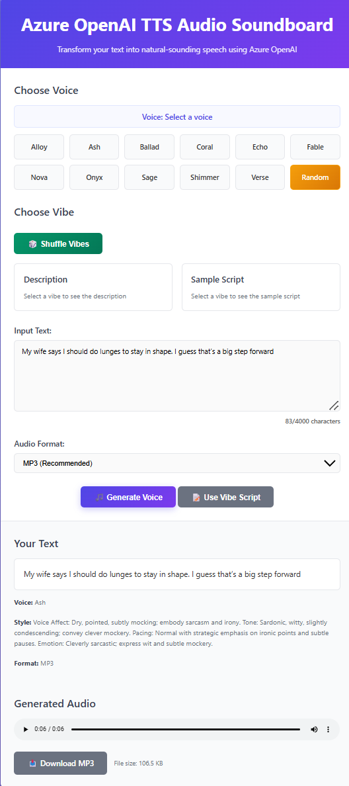

# 🎵 Azure OpenAI TTS Audio Soundboard

A modern, interactive text-to-speech application built with Spring Boot and Azure OpenAI's **gpt-4o-mini-tts** model (2025-03-20). Transform any text into natural-sounding speech with multiple voice options, customizable styles, and advanced tone guidance.


## 🎬 Live Demo



### 📸 What You're Seeing

This screenshot showcases the **Azure OpenAI TTS Audio Soundboard** interface, featuring a modern soundboard design with voice selection buttons, vibe system controls, text input area, and audio generation controls. The application transforms text-to-speech generation into an intuitive, visual experience.

## ✨ Features

### 🎤 **Voice Selection**
- **11 Premium Voices**: Alloy, Ash, Ballad, Coral, Echo, Fable, Nova, Onyx, Sage, Shimmer, Verse
- **Interactive Voice Buttons** with visual feedback and hover effects
- **Random Voice Selection** for variety and experimentation

### 🎭 **Advanced Vibe System**
- **12 Predefined Vibes**: Excited, Calm, Professional, Friendly, Mysterious, Dramatic, Playful, Whisper, Angry, Sad, Cheerful, Sarcastic
- **Sample Scripts** for each vibe to get started quickly
- **Shuffle Vibes** functionality to discover new combinations
- **Dynamic Vibe Loading** with interactive selection

### 🎚️ **Audio & Interface**
- **Multiple Audio Formats**: MP3 (recommended), WAV (high quality), Opus (compact)
- **Auto-play Support** with fallback for browser restrictions
- **Download Options** for generated audio files
- **Modern Soundboard Design** with responsive layout
- **Character Counter** with smart validation (up to 4,000 characters)
- **Real-time Audio Streaming** with instant playback

### 🛡️ **Rate Limiting & Security**
- **Smart Rate Limiting**: 10 requests per minute, 100 requests per hour
- **Character Limits**: 50,000 characters per hour to prevent abuse
- **Per-Client Tracking**: Individual limits based on IP address
- **Configurable Limits**: Adjustable via environment variables
- **Graceful Handling**: Clear error messages when limits are exceeded

## 🚀 Quick Start

### Prerequisites
- [Azure Developer CLI (azd)](https://aka.ms/azd-install)
- Azure subscription with access to East US or East US 2 regions

### Deploy to Azure
```bash
git clone https://github.com/roryp/ttsazure.git
cd ttsazure
azd up
```

After deployment, azd will provide your live application URL.

### Local Development (Optional)
```bash
# Ensure Java 21+ and Maven are installed
mvn spring-boot:run
# Access at: http://localhost:8080
```

## 📱 How to Use

1. **Select a Voice**: Choose from 11 premium voices or click "Random"
2. **Choose a Vibe** (Optional): Select a predefined vibe for automatic voice styling and sample text
3. **Enter Your Text**: Type or paste up to 4,000 characters
4. **Generate Speech**: Select audio format (MP3/WAV/Opus) and click "🎵 Generate Voice"
5. **Download & Share**: Use audio controls to play, download, or share your generated speech

## 🔧 API Endpoints

The application provides several REST endpoints for advanced usage:

### Audio Generation
- `POST /tts` - Generate speech from form data
- `POST /api/quick-tts` - JSON API for programmatic access

### Audio Retrieval
- `GET /audio/{id}` - Stream generated audio file
- `GET /audio/{id}?download=true` - Download audio file

### Vibe Management
- `GET /api/vibes` - Get random vibes (default: 6)
- `GET /api/vibes?count=12` - Get specific number of vibes
- `GET /api/vibe/{name}` - Get specific vibe details

### System Health & Rate Limits
- `GET /health` - Application health, cache status, and rate limit configuration
- `GET /api/rate-limit-status` - Current rate limit usage for your IP

## 🏗️ Architecture

### Technology Stack
- **Backend**: Spring Boot 3.5.4 with Java 21
- **Frontend**: Thymeleaf templates with modern CSS and JavaScript
- **AI Service**: Azure OpenAI **gpt-4o-mini-tts** (2025-03-20) with GlobalStandard deployment
- **Cloud Platform**: Azure Container Apps with Container Registry
- **Authentication**: Azure Managed Identity with token-based authentication (no API keys)
- **Audio Processing**: Java HttpClient with streaming support
- **Caching**: In-memory audio store with TTL management

### Project Structure
```
ttsazure/
├── src/
│   ├── main/
│   │   ├── java/com/ttsapp/tts/
│   │   │   ├── TtsApplication.java      # Main application
│   │   │   ├── TtsController.java       # Web controller
│   │   │   ├── OpenAIService.java       # Azure OpenAI integration (with managed identity)
│   │   │   ├── AudioStore.java          # Audio caching
│   │   │   └── VibeService.java         # Vibe management
│   │   └── resources/
│   │       ├── templates/index.html     # Main UI template
│   │       ├── static/styles.css        # Modern styling
│   │       ├── vibes.json              # Vibe configurations
│   │       └── application.yml         # Spring configuration (no secrets)
├── infra/                              # Azure infrastructure (Bicep)
├── pom.xml                             # Maven dependencies
└── README.md                           # This file
```

## 🎨 Customization

### Adding New Vibes
Edit `src/main/resources/vibes.json` to add new voice styles:
```json
{
  "name": "Custom Vibe",
  "description": "Voice instructions here...",
  "script": "Sample text for this vibe..."
}
```

### Styling Changes
Modify `src/main/resources/static/styles.css` to customize:
- Color schemes and themes
- Button layouts and animations
- Responsive breakpoints
- Visual effects and transitions

### Voice Configuration
Update the voice list in `TtsController.java`:
```java
private static final List<String> AVAILABLE_VOICES = List.of(
    "alloy", "ash", "ballad", "coral", "echo", 
    "fable", "nova", "onyx", "sage", "shimmer", "verse"
);
```

### Rate Limiting Configuration
Adjust rate limits via environment variables or `application.yml`:
```yaml
app:
  rate-limit:
    max-requests-per-minute: 10
    max-requests-per-hour: 100
    max-characters-per-hour: 50000
    enabled: true
```

Or use environment variables:
- `RATE_LIMIT_REQUESTS_PER_MINUTE` - Requests per minute (default: 10)
- `RATE_LIMIT_REQUESTS_PER_HOUR` - Requests per hour (default: 100)
- `RATE_LIMIT_CHARACTERS_PER_HOUR` - Characters per hour (default: 50,000)
- `RATE_LIMIT_ENABLED` - Enable/disable rate limiting (default: true)

## � Authentication & Security

### Managed Identity Authentication
This application uses **Azure Managed Identity** for secure, keyless authentication:

- **No API Keys**: Zero secrets stored in code, configuration, or environment variables
- **Automatic Token Management**: Azure handles token generation, rotation, and renewal
- **DefaultAzureCredential**: Uses the standard Azure identity library for seamless authentication
- **Bearer Token Authentication**: Each API call obtains a fresh token for `https://cognitiveservices.azure.com`
- **RBAC Integration**: Managed identity has minimal required permissions (Cognitive Services OpenAI User)

### How It Works
1. **Container Apps assigns** a managed identity to the application
2. **Application requests** an access token using `DefaultAzureCredential`
3. **Azure AD issues** a bearer token for the Cognitive Services scope
4. **API calls use** the token in `Authorization: Bearer <token>` headers
5. **Tokens auto-refresh** when they expire (no manual intervention needed)

### Security Benefits
- 🔒 **Zero Secret Management**: No keys to rotate, store, or secure
- 🔄 **Automatic Rotation**: Tokens refresh automatically every hour
- 🎯 **Least Privilege**: Identity has only the minimum required permissions
- 📊 **Audit Trail**: All authentication events logged in Azure AD
- 🛡️ **No Network Exposure**: Tokens never leave the Azure security boundary

### Additional Security Features
- **Rate Limiting**: Protects against abuse with configurable per-client limits
- **Input Validation**: Text length and format validation
- **Error Handling**: Graceful error messages without exposing internals
- **CORS Support**: Configurable for different deployment environments

## 🚀 Deployment

### Azure Deployment (Recommended)
Use Azure Developer CLI for one-command deployment:

```bash
# Deploy everything to Azure
azd up
```

This single command handles:
- 🏗️ **Infrastructure Creation**: Azure OpenAI, Container Registry, Container Apps
- 🤖 **AI Model Deployment**: gpt-4o-mini with TTS support (2025-03-20)
- 🔒 **Security Setup**: Managed Identity, RBAC roles, token-based authentication
- 📦 **Application Build**: Containerizes and deploys your Spring Boot app
- 🌐 **Network Configuration**: Public endpoints with CORS and health checks

### Environment Management
```bash
# List environments
azd env list

# Switch environments
azd env select <environment-name>

# View environment variables
azd env get-values

# Clean up resources
azd down
```

### Local Development
For development and testing:
```bash
# Ensure Java 21+ is installed
java --version

# Run locally (connects to Azure resources using your Azure CLI login)
az login  # Login to Azure first
mvn spring-boot:run
```

**Note**: Local development uses your Azure CLI credentials through `DefaultAzureCredential`. No API keys needed!

### Production Updates
```bash
# Deploy code changes
azd deploy

# Update infrastructure
azd provision

# Full redeploy
azd up
```

## 📊 Monitoring

### Health Checks
- Application health: `GET /health`
- Cache statistics included in health endpoint
- Spring Boot Actuator endpoints available

### Logging
- Structured logging with configurable levels
- Request/response tracking
- Audio generation metrics
- Error tracking and reporting

## 🤝 Contributing

1. Fork the repository
2. Create a feature branch: `git checkout -b feature-name`
3. Make your changes and test thoroughly
4. Commit with clear messages: `git commit -m "Add feature description"`
5. Push to your fork: `git push origin feature-name`
6. Create a Pull Request

## 📝 License

This project is licensed under the MIT License - see the [LICENSE](LICENSE) file for details.

## 🆘 Support

### Common Issues

**First Time Setup**
```bash
# Install Azure Developer CLI
# Windows: winget install microsoft.azd
# macOS: brew install azure-dev
# Linux: curl -fsSL https://aka.ms/install-azd.sh | bash

# Then deploy
azd up
```

**Authentication Issues**
```bash
# Login to Azure
azd auth login

# Check current subscription
azd config get defaults.subscription

# Set specific subscription if needed
azd config set defaults.subscription <subscription-id>

# For local development, ensure Azure CLI is logged in
az login
az account show  # Verify correct subscription
```

**Managed Identity Issues**
- Verify the managed identity has "Cognitive Services OpenAI User" role
- Check that the Container App is using the correct managed identity
- Ensure the Azure OpenAI resource is in the same subscription
- Use `azd monitor` to check authentication logs

**Deployment Failures**
- Ensure you have Contributor role on the Azure subscription
- Check that your subscription has Azure OpenAI service enabled
- Verify you're deploying to East US or East US 2 (supported regions)
- Use `azd monitor` to check deployment logs

**Model Availability**
- gpt-4o-mini with TTS is only available in East US and East US 2
- The infrastructure automatically selects the correct region
- No manual model deployment needed - azd handles everything

**Resource Cleanup**
```bash
# Remove all Azure resources
azd down --purge

# Keep data but stop services
azd down
```

### Getting Help
- Open an issue on GitHub for bugs
- Check existing issues for solutions  
- Use `azd monitor` to view application logs
- Review Azure OpenAI documentation for API limits
- Check deployment status with `azd env get-values`